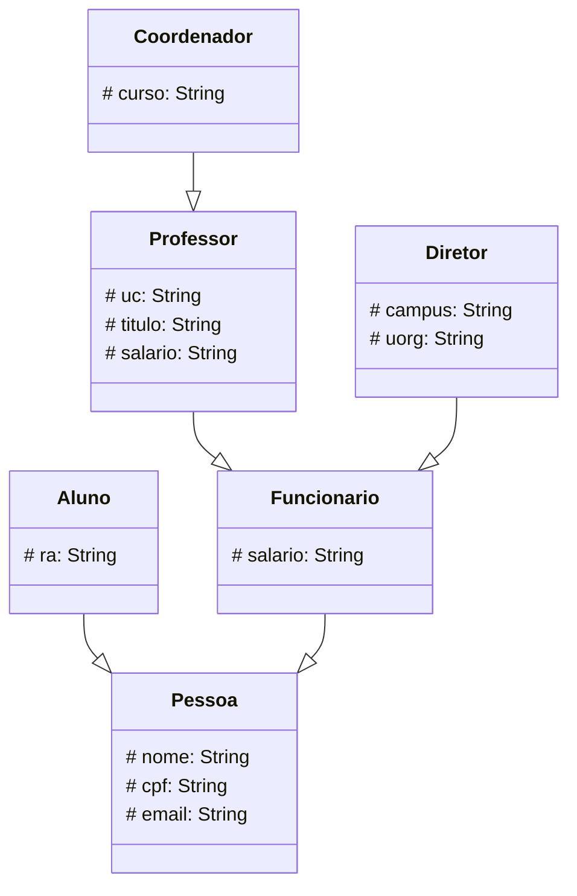
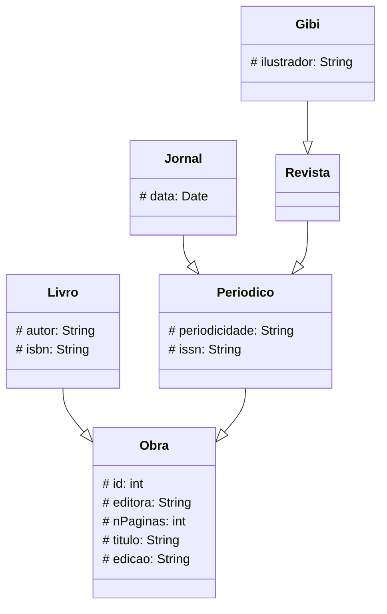

```mermaid
classDiagram
    
    class Pessoa{
        # nome: String
        # cpf: String
        # email: String
    }
    
    class Funcionario{
        # salario: String
    }
    
    class Aluno{
        # ra: String
    }
    
    class Professor{
        # uc: String
        # titulo: String
        # salario: String
    }
    
    class Coordenador{
        # curso: String
    }
    
    class Diretor{
        # campus: String
        # uorg: String
    }
    
    Aluno --|> Pessoa
    Funcionario --|> Pessoa
    Professor --|> Funcionario
    Coordenador --|> Professor 
    Diretor --|> Funcionario
    

```

```mermaid
classDiagram
    class Obra{
        # id: int
        # editora: String
        # nPaginas: int
        # titulo: String
        # edicao: String
    }
    
    class Periodico{
        # periodicidade: String
        # issn: String
    }
    
    class Livro{
        # autor: String
        # isbn: String
    }
    
    class Revista{
        
    }
    
    class Jornal{
        # data: Date
    }
    
    class Gibi{
        # ilustrador: String
    }
    Livro --|> Obra
    Periodico --|> Obra
    Jornal --|> Periodico
    Revista --|> Periodico
    Gibi --|> Revista
    


```