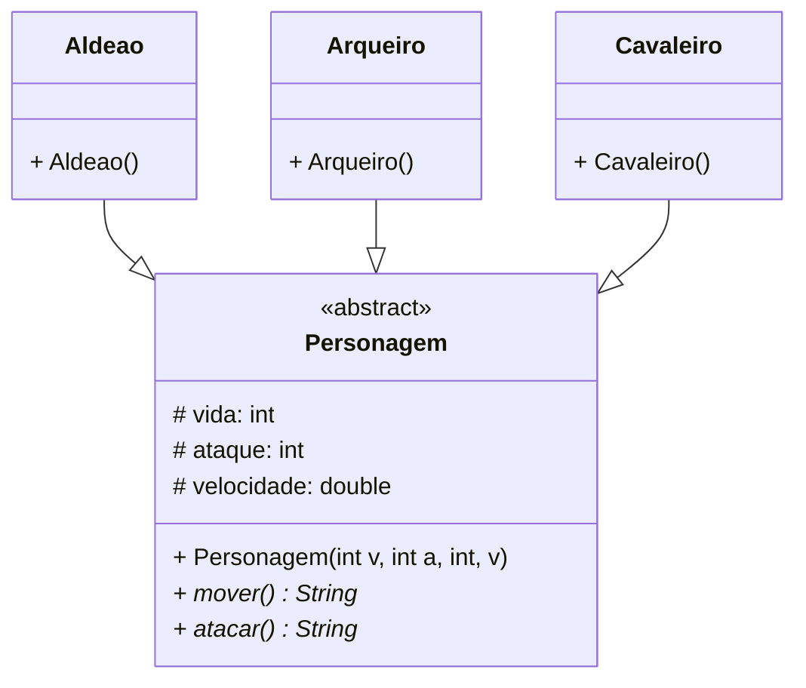

```mermaid
classDiagram
    class Personagem{
        <<abstract>>
        # vida: int
        # ataque: int
        # velocidade: double
        + Personagem(int v, int a, int, v)
        + mover() String *
        + atacar() String *
    }
    
    class Aldeao{
        + Aldeao()
    
        
    }
    
    class Arqueiro{
        + Arqueiro()

    }
    
    class Cavaleiro{
        + Cavaleiro()
       
    }

    Aldeao --|> Personagem
    Arqueiro --|> Personagem
    Cavaleiro --|> Personagem
```