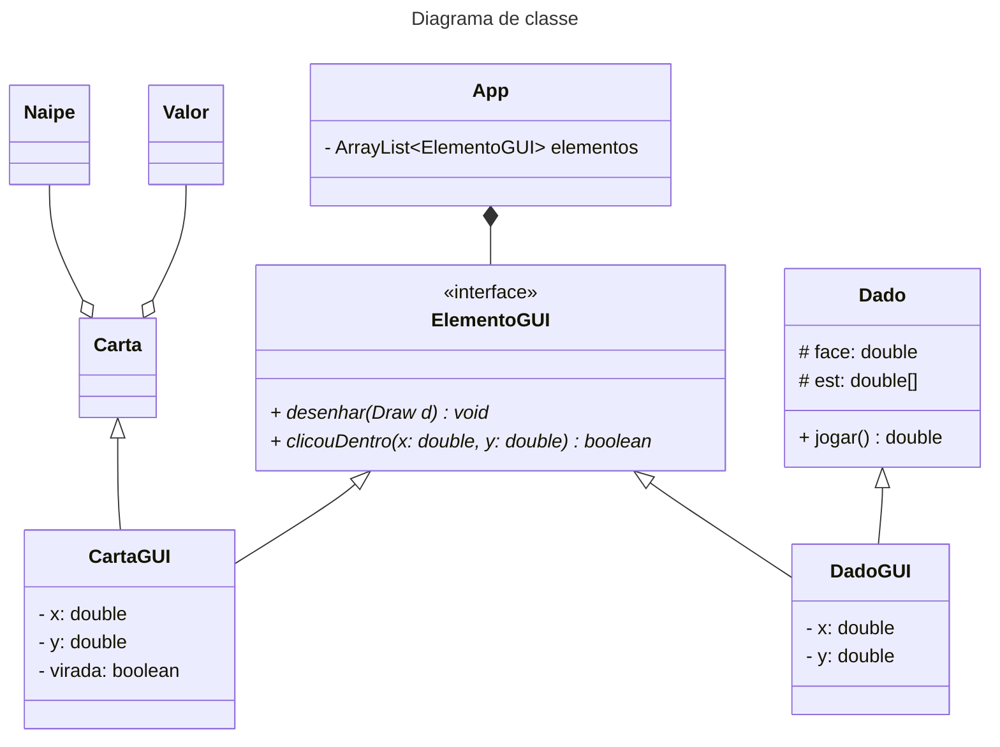

```mermaid
---
title: Diagrama de classe
---
classDiagram
    direction TB
    
%% Composição *--
%% Herança <|--
%% Agregação --o

    App *-- ElementoGUI
    Carta <|-- CartaGUI
    Naipe --o Carta
    Valor --o Carta
    Dado <|-- DadoGUI
    ElementoGUI <|-- CartaGUI
    ElementoGUI <|-- DadoGUI

    class Naipe {
    }

    class Valor {
    }

    class Carta {
    }

    class CartaGUI {
        - x: double
        - y: double
        - virada: boolean
    }

    class Dado {
        # face: double
        # est: double[]
        + jogar() double
    }

    class DadoGUI {
        - x: double
        - y: double
    }

    class ElementoGUI {
        <<interface>>
        + desenhar(Draw d) void*
        + clicouDentro(x: double, y: double) boolean*
    }

    class App {
        - ArrayList~ElementoGUI~ elementos
    }
```