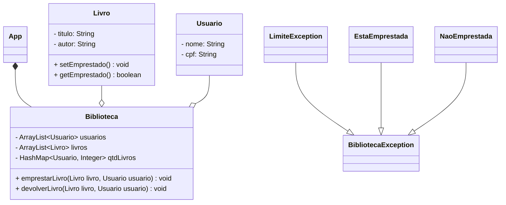

```mermaid
    classDiagram
        
        App *-- Biblioteca
        LimiteException --|> BibliotecaException
        EstaEmprestada --|> BibliotecaException
        NaoEmprestada --|> BibliotecaException
        Livro --o Biblioteca
        Usuario --o Biblioteca
        
        class Biblioteca{
            - ArrayList~Usuario~ usuarios
            - ArrayList~Livro~ livros
            - HashMap~Usuario, Integer~ qtdLivros
            + emprestarLivro(Livro livro, Usuario usuario) void
            + devolverLivro(Livro livro, Usuario usuario) void
        }
        
        class Livro{
            - titulo: String
            - autor: String
            + setEmprestado() void
            + getEmprestado() boolean
        }
        
        class App{
        }
        
        class BibliotecaException{
        }
        
        class LimiteException{
            
        }
        
        class EstaEmprestada{
            
        }
        
        class NaoEmprestada{
            
        }
        
        class Usuario{
            - nome: String
            - cpf: String
        }
        
        
```