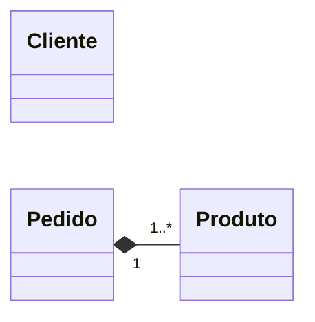

# 1 Modelagem de diagrama de classes UML

### Para cada um dos seguintes cenários, crie um diagrama de classes UML que represente as entidades envolvidas e seus relacionamentos. Lembre-se de identificar os tipos de associação (agregação ou composição) e as multiplicidades (1, 0..1, *, etc.) entre as classes. É importante colocar todos os atributos relevantes para cada classe, bem como os métodos básicos que possam ser necessários para demonstrar as relações entre as classes. Não é necessário colocar métodos triviais (getters e setters).

## 1.1 Sistema de comércio eletrônico

### Um produto tem uma descrição, um preço e uma quantidade em estoque. Um cliente tem um nome, um e-mail e um ou mais endereços de entrega. Um cliente pode fazer um ou mais pedidos. Um pedido tem uma data, uma situação (pendente, pago, entregue, cancelado), um ou mais produtos, sendo que cada produto tem uma quantidade e um preço unitário.

## 1.2 Sistema de avaliações de filmes

### Um filme tem um título, um ano de lançamento, um gênero, um diretor e um ou mais atores. Um ator tem um nome e uma data de nascimento. Um filme pode ter uma ou mais avaliações, e cada avaliação está associada a um único filme e a um único usuário. Um usuário tem um nome, um e-mail e uma senha. Um usuário pode avaliar um ou mais filmes. Uma avaliação tem uma nota (de 1 a 5) e um comentário.

## 1.3 Sistema de gestão de frotas

### Uma empresa possui uma frota de veículos. Cada veículo tem um modelo, uma placa e um ano de fabri- cação. A empresa tem vários motoristas, e cada motorista pode dirigir um ou mais veículos. A empresa registra o uso de cada veículo, incluindo a data, o motorista e a distância percorrida.

## 1.4 Sistema de reserva de passagens aéreas

### Uma companhia aérea oferece voos para diversos destinos. Cada voo tem um número de voo, um destino, uma data e uma hora de partida, e uma capacidade máxima de passageiros. Os passageiros podem reservar assentos em um voo, e cada reserva está associada a um único passageiro e a um único voo. Um passageiro tem um nome, um e-mail e um número de telefone.

## 2 Implementação em Java

### Para cada um dos cenários descritos na seção anterior, implemente as classes e os relacionamentos identificados utilizando a linguagem de programação Java. Instancie objetos para representar os dados e testar as relações entre as classes. Certifique-se de utilizar os conceitos de associação, agregação e composição conforme apropriado para cada caso. Não é necessário implementar toda a funcionalidade do sistema, mas sim criar as classes e os métodos básicos para demonstrar os relacionamentos entre elas.

