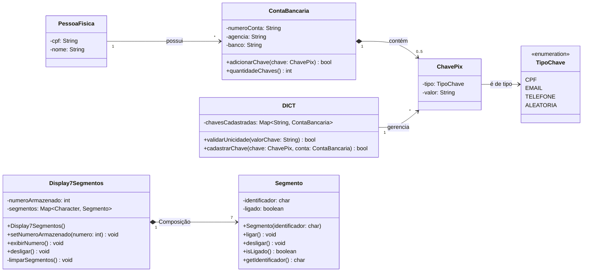

```mermaid
classDiagram
direction LR

class DICT {
-chavesCadastradas: Map~String, ContaBancaria~
+validarUnicidade(valorChave: String) bool
+cadastrarChave(chave: ChavePix, conta: ContaBancaria) bool
}

class PessoaFisica {
-cpf: String
-nome: String
    }

class ContaBancaria {
-numeroConta: String
-agencia: String
-banco: String
+adicionarChave(chave: ChavePix) bool
+quantidadeChaves() int
    }

class ChavePix {
-tipo: TipoChave
-valor: String
    }

class TipoChave {
<<enumeration>>
CPF
EMAIL
TELEFONE
ALEATORIA
}

%% Relacionamentos e Multiplicidades
PessoaFisica "1" --> "*" ContaBancaria : possui
ContaBancaria "1" *--> "0..5" ChavePix : contém
ChavePix --> TipoChave : é de tipo
DICT "1" --> "*" ChavePix : gerencia

class Display7Segmentos {
-numeroArmazenado: int
-segmentos: Map~Character, Segmento~
+Display7Segmentos()
+setNumeroArmazenado(numero: int) void
+exibirNumero() void
+desligar() void
-limparSegmentos() void
}

class Segmento {
-identificador: char
-ligado: boolean
+Segmento(identificador: char)
+ligar() void
+desligar() void
+isLigado() boolean
+getIdentificador() char
}

Display7Segmentos "1" *--> "7" Segmento : Composição

```